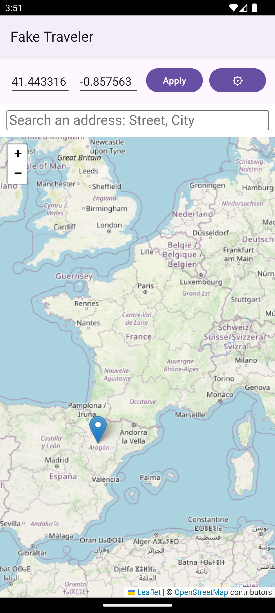
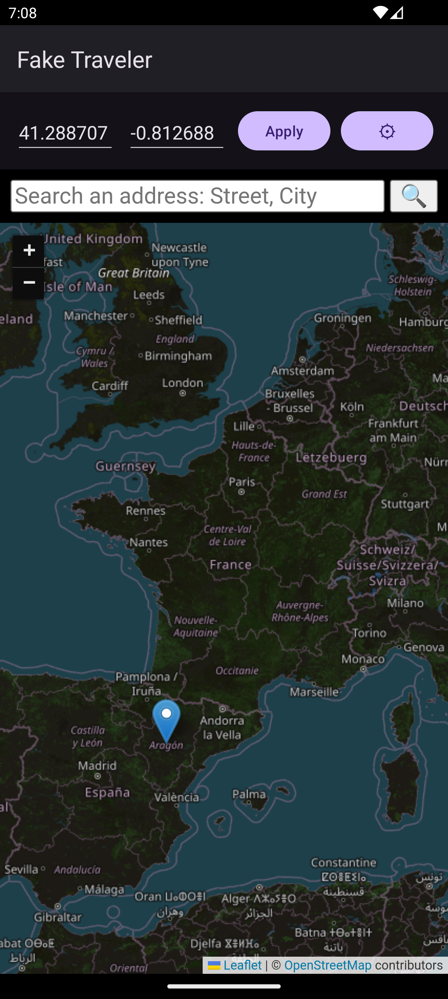
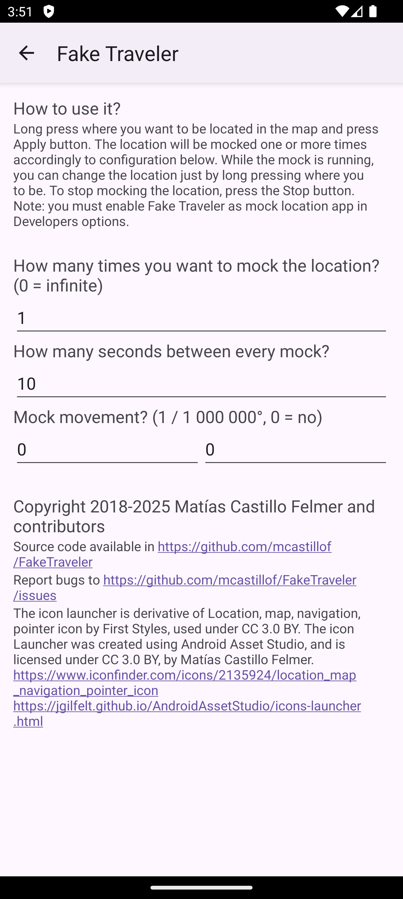
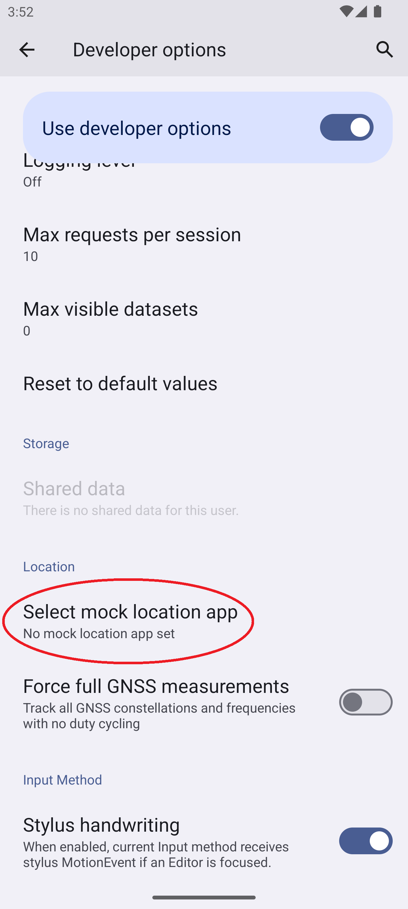
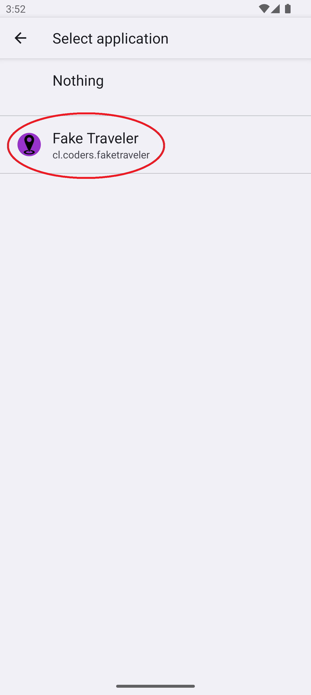

# FakeTraveler

Fake where your phone is located (Mock location for Android).

Sometimes you need to fake the location of your device (for privacy or to test an app). Fake Traveler provides you a map to select the location where you want your phone to be.

## How does it work?

Long press in the map where you want to be located or type the latitude and longitude, and tap the Apply button. Tapping the gear (⚙) button will show settings to mock the location over a period of time, restore mocking after reboot, import a GPX route, and adjust battery/background settings on aggressive OEMs.

While mocking, FakeTraveler shows a persistent notification with a STOP action. The service survives swiping the app from Recents so target apps (Google Maps, OsmAnd, etc.) keep seeing the mocked location.

### Notes

If your reported location appears to bounce from one location to another or is otherwise unstable, you
may want to go to system **Settings**, and in **Location services**, disable **Wi-Fi scanning** and
**Bluetooth scanning** as these alternate location providers may compete with the GPS location data
you are mocking.

## Requirements

In order to work, you need to allow Fake Traveler to mock locations. You have to [enable Developer options](https://developer.android.com/studio/debug/dev-options?hl=en-419) and select this app in "Settings/System/Developer options/Select mock location app" option.

### Android version support

| Android | API | Status |
|---|---|---|
| 5.0 Lollipop – 7.1 Nougat | 21 – 25 | Supported. Legacy notification + 10-arg `addTestProvider` path. |
| 8.0 Oreo – 9 Pie | 26 – 28 | Supported. Notification channel. |
| 10 Q – 11 R | 29 – 30 | Supported. `foregroundServiceType="location"`. |
| 12 S – 12L | 31 – 32 | Supported. `ProviderProperties` API; `FUSED_PROVIDER` mocked. |
| 13 Tiramisu | 33 | Supported. Runtime POST_NOTIFICATIONS check. |
| 14 UpsideDownCake – 16 Baklava | 34 – 36 | Supported. `FOREGROUND_SERVICE_LOCATION` permission. |

### Permissions

FakeTraveler 2.4.0 declares the following permissions:

| Permission | Purpose |
|---|---|
| `INTERNET` | Fetch map tiles and run Nominatim address search. |
| `ACCESS_MOCK_LOCATION` | Required by Android to register test providers. Granted via Developer options. |
| `ACCESS_COARSE_LOCATION` | Required by Android 14+ when the service declares `foregroundServiceType="location"`. The app does not read your real location. |
| `FOREGROUND_SERVICE` | Required to run the mocking service in the foreground (Android 9+). |
| `FOREGROUND_SERVICE_LOCATION` | Required to declare the service as location-typed (Android 14+). |
| `POST_NOTIFICATIONS` | Show the persistent STOP-capable notification (Android 13+ runtime). |
| `RECEIVE_BOOT_COMPLETED` | Optional "Restore mocking after reboot" feature. |
| `REQUEST_IGNORE_BATTERY_OPTIMIZATIONS` | Optional. Lets the app deep-link you to system battery-optimization settings on aggressive OEMs. |

## OEM-specific setup

Some manufacturers aggressively kill background apps even when they hold a foreground notification. If FakeTraveler stops mocking after a while, open **Settings → Battery / background settings** inside the app and follow the dialog. Coverage:

| OEM | What to do |
|---|---|
| Xiaomi / Redmi / POCO (MIUI/HyperOS) | Enable **Autostart** for FakeTraveler; disable battery saver for it. |
| Samsung (One UI) | Add FakeTraveler to **Never sleeping apps** under Battery → Background usage limits. |
| OnePlus / OPPO / Realme (ColorOS) | Enable **App Auto Launch** for FakeTraveler under Privacy permissions → Startup manager. |
| Huawei / Honor (EMUI / HarmonyOS) | Set FakeTraveler to **Manage manually** with all three switches on (Battery → App launch). |
| Vivo (FunTouch / Origin OS) | Set FakeTraveler to **Allow background activity** under Battery → Background power usage. |
| Stock Android (Pixel, /e/, GrapheneOS) | No special action needed. |

## FAQ

**Why does my mocked location jump?**
FakeTraveler now mocks the GPS, Network, *and* Fused providers (Android 12+). If you still see jumps, check **Settings → Location → Wi-Fi scanning** and **Bluetooth scanning**. Some OEMs aggressively re-snap to real position when those are on.

**Why does the app stop mocking after a few minutes?**
Mostly: aggressive OEM battery savers. Open the in-app **Battery / background settings** button and follow the dialog for your manufacturer. Stock Android (Pixel) does not need this.

**Why does FakeTraveler need the location permission?**
Android 14+ requires any foreground service tagged `foregroundServiceType="location"` to also hold `ACCESS_COARSE_LOCATION`. The app does *not* read your real GPS — it only registers mock providers.

**Can FakeTraveler spoof location for *only* one specific app?**
No. The mock-location framework feeds the spoofed coordinates to all apps system-wide. Per-app spoofing requires Xposed/LSPosed or root.

**Can I replay a GPX track?**
Yes — open ⚙ → "Import GPX route", pick a file, then tap "Play imported route". The track is iterated once per "Mock frequency" tick and loops at the end.

## Changelogs

See `fastlane/metadata/android/en-US/changelogs/`.

## License
Copyright © 2018 Matías Castillo Felmer

> This program is free software: you can redistribute it and/or modify
> it under the terms of the GNU General Public License as published by
> the Free Software Foundation, either version 3 of the License, or
> (at your option) any later version.
>
> This program is distributed in the hope that it will be useful,
> but WITHOUT ANY WARRANTY; without even the implied warranty of
> MERCHANTABILITY or FITNESS FOR A PARTICULAR PURPOSE.  See the
> GNU General Public License for more details.
>
> You should have received a copy of the GNU General Public License
> along with this program.  If not, see <https://www.gnu.org/licenses/>.

The launcher icon was created by [@ArtistDev44](https://portfolio-guillaume-renoult.vercel.app/) (see #77) - thank you very much for your work!
